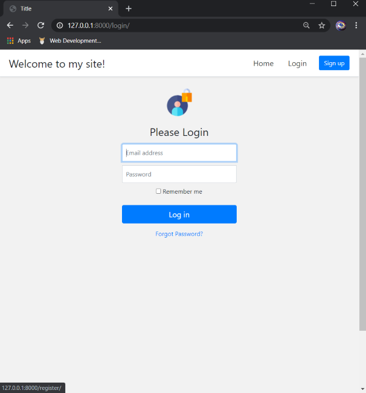
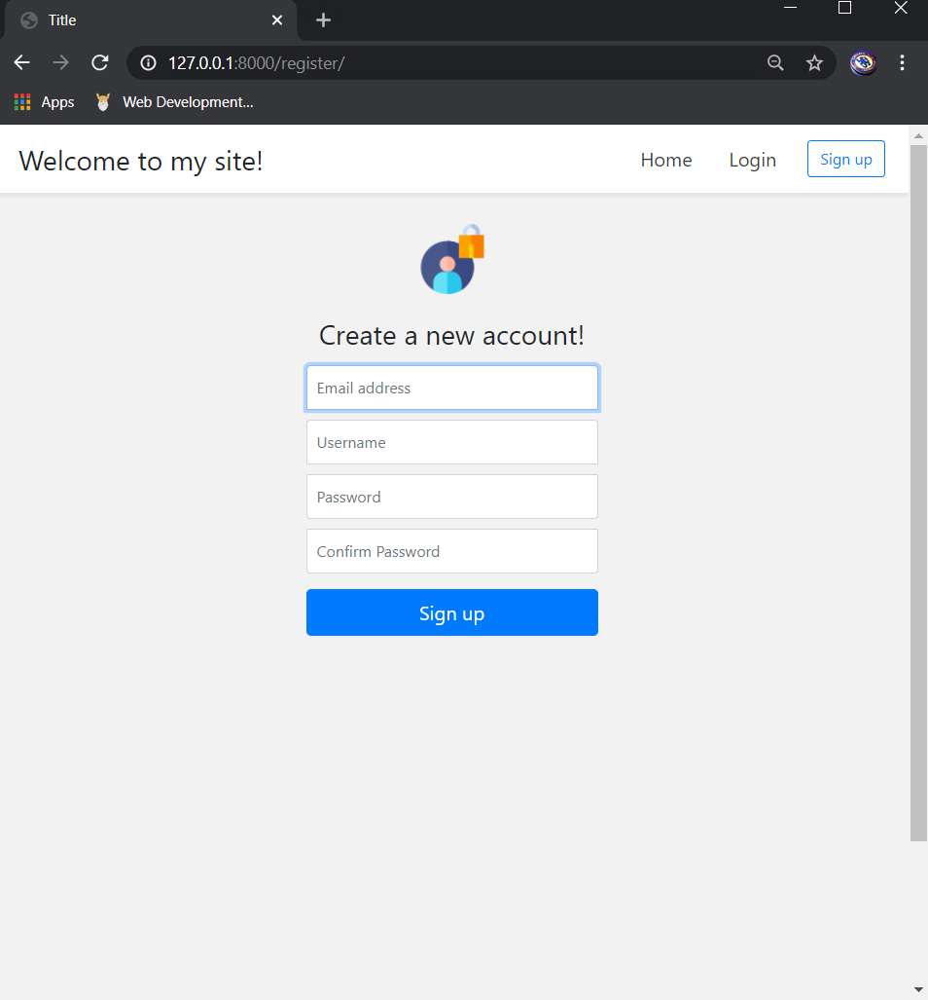

# my-site
###### (Project currently on-going)
 A Django based site created to for learning backend and frontend basics.
 This project makes use of user registration and authentication concepts.
 
 User can register, or login if already registered. After logging in user can also change their account details and password.
## Home Screen:

User can login or create a new account. Whenever new account is created, account details are stored in the backend.

## Login Screen:

The 'forgot password' password feature allows user to enter their registered email id and get a link to create a new password for that account.

## Sign-Up Screen:

