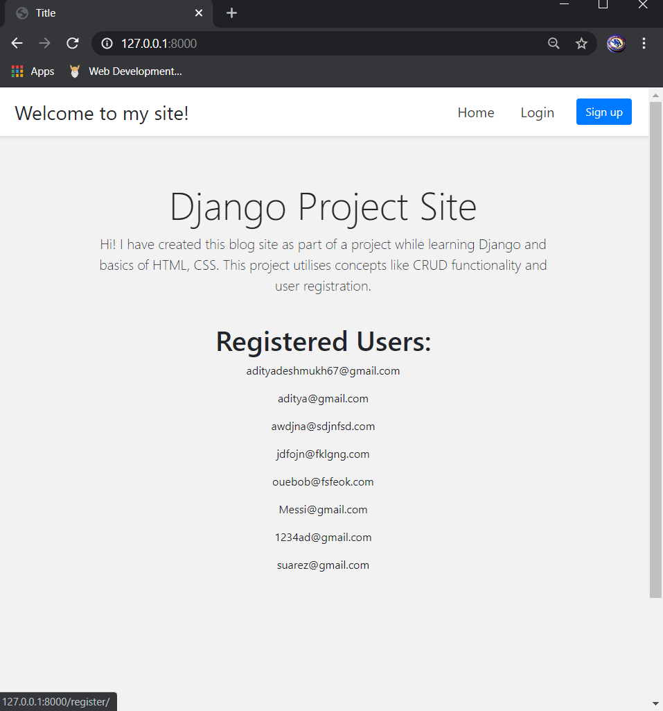
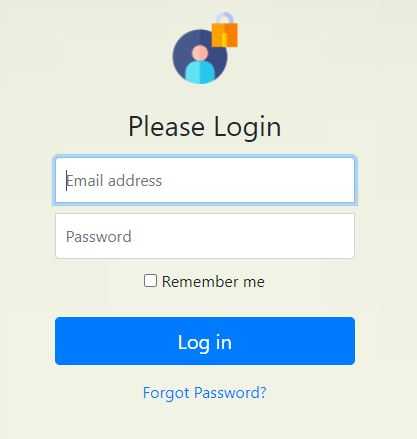
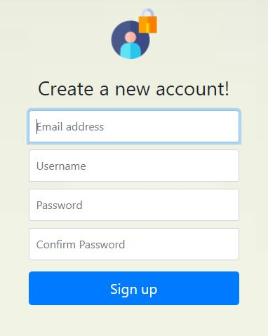

# my-site
###### (Project currently on-going)
 A Django based site created to for learning backend and frontend basics.
 This project makes use of user registration and authentication concepts as well as CRUD functionality.
 
 User can register, or login if already registered. After logging in, user can also change their account details and password.
 Posts can be created with images and descriptions.
## Home Screen:

User can login or create a new account. Whenever new account is created, account details are stored in the backend.

A search bar is provided at the top which searches for posts according to keywords given to it.

## Login Screen:

The 'forgot password' feature allows user to enter their registered email id and get a link to create a new password for that account.
Password can also be changed after logging in and navigating to 'Accounts' page.
## Sign-Up Screen:

