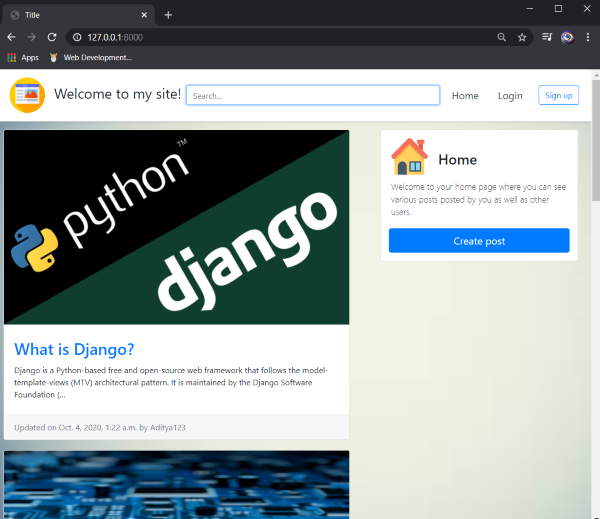

# my-site
###### (Project currently on-going)
A Django based site created to for learning backend and frontend basics.
This project makes use of user registration and authentication concepts as well as CRUD functionality. User can register, or login if already registered. After logging in, user can also change their account details and password. Posts can be created with images and descriptions.
 
REST APIs were implemented for the major functionalities like account registration, login, logout etc., and creating, editing or deleting posts. The APIs were created only to serve the purpose of learning their implementation. They are not being utilised on any other application.
 
## Home Screen:


The home screen displays the posts created by all the users registered on the site.
A search bar is provided at the top which searches for posts according to keywords given to it.

## Login Screen:


User can login or create a new account. Whenever new account is created, account details are stored in the backend.

The 'forgot password' feature allows user to enter their registered email id and get a link to create a new password for that account.
Password can also be changed after logging in and navigating to 'Account' page.

## Sign-Up Screen:


## How to run?
To run locally you must have Python3 installed in your system. Django2.2 should also installed in your system. To install Django in your system run the following command in the command promt:
```
pip install django==2.2
```
Download this repo and run the following command in your command prompt:
```
python manage.py runserver
```

After running, paste the IP address generated, in your browser to open the site.
